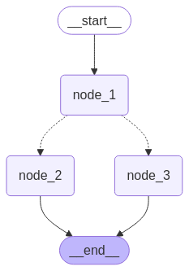
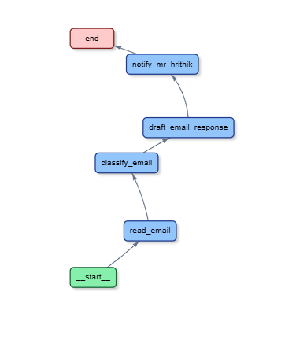
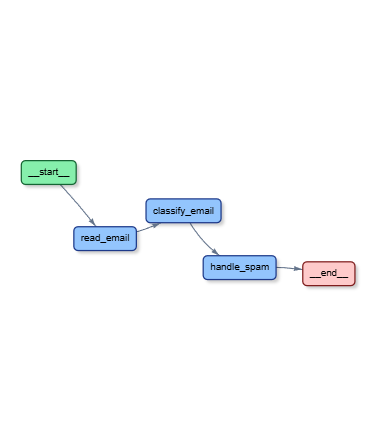
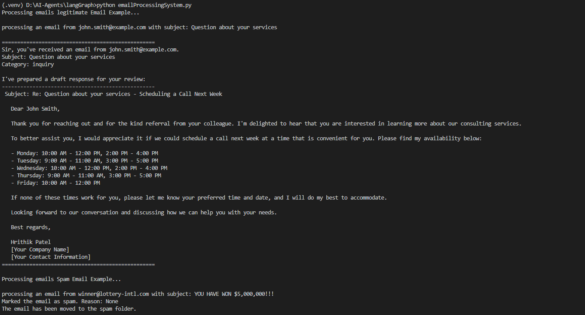

# 🔗 LangGraph Agents

This folder demonstrates agent workflows using **[LangGraph](https://github.com/langchain-ai/langgraph)** — a framework for building dynamic, condition-based computation graphs over LLMs.

## 📁 Contents

- `basicGraph.py` – A simple branching graph with conditional routing.
- `emailProcessingSystem.py` – An intelligent email classification and response graph agent.

### 💡 LLM Backend

- Powered by **Mistral (7B)** served locally via ollama
- Managed using langchain_ollama.ChatOllama

## ⚙️ How It Works


### 1. `basicGraph.py`
- Builds a basic state graph with 3 nodes: one shared starting point and a conditional path to two possible outcomes.
- Simulates mood logic with 50% chance of being "Happy" or "Sad".

### 2. `emailProcessingSystem.py`
- Processes emails through a LangGraph-powered flow:
  - Reads email
  - Classifies as spam or legitimate using **Mistral** (via `ollama`)
  - Handles spam or drafts a polite response
  - Notifies Mr. Hrithik with the response
- Integrates **Langfuse** for tracing and observability.

## 🧠 Agent Flow Visualizations

### 📌 Basic Graph:


### 📬 Legitimate Email Flow:


### 🚫 Spam Email Flow:


## 🔍 Sample Output (Console)


## 🚀 Running the Examples

Make sure you have the environment set up (with `.env` keys for Langfuse if enabled) and `ollama` running.

### Basic Graph
```bash
python basicGraph.py
```

### Email Processing System
```bash
python emailProcessingSystem.py
```

## 📝 Highlights
- Dynamic routing using `add_conditional_edges()`
- Tracks state throughout the flow
- Realistic application of LLMs for workflow automation

---

> This is part of the [AI Agents Playground](../README.md) project. Explore other folders to compare different agent frameworks.

