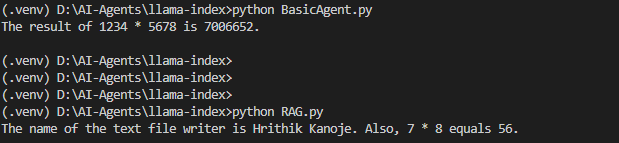

# 🧠 LlamaIndex Agents

This folder demonstrates agent workflows using **[LlamaIndex](https://github.com/jerryjliu/llama_index)**. LlamaIndex provides powerful tools for building document-aware agents and enabling tool-augmented reasoning.

## 📁 Contents

- `BasicAgent.py` – A simple agent that multiplies numbers using a built-in tool.
- `RAG.py` – An enhanced Retrieval-Augmented Generation (RAG) agent with access to documents and tools.

## ⚙️ How It Works

### 1. LLM Backend
- Both agents use the **qwen2.5 (7B)** model served locally via `ollama`.
- Managed through the `llama_index.llms.ollama` interface.

### 2. Tool Usage
- `multiply(a, b)` – Custom tool for basic math.
- `search_documents(query)` – Asynchronous document search using `VectorStoreIndex`.

### 3. Document Retrieval
- Uses `SimpleDirectoryReader` to load documents from a directory (`/data`).
- Embeddings are created with **HuggingFace's BAAI/bge-base-en-v1.5** model.

## 🚀 Running the Examples

Make sure `ollama` is running and that you've followed the [root setup instructions](../README.md#setup-instructions).

### 🔢 Basic Calculator Agent
```bash
python BasicAgent.py
```
*Multiplies two numbers using a functional tool agent.*

### 📄 RAG Agent
```bash
python RAG.py
```
*Answers natural language queries about documents and performs calculations.*

## 🧠 Agent Architecture

```
RAG.py
└── AgentWorkflow
    ├── multiply tool
    └── search_documents tool
        └── VectorStoreIndex (built from loaded directory)
```

## 🔍 Example Use Case
**Input:**
> What is the name of text file writer? Also, what's 7 * 8?

**Output:**
> [Agent finds author info in document + answers math]


---

## 📌 Notes
- Ollama server must be running before executing any scripts.
- Place your documents in the path expected by `SimpleDirectoryReader` (e.g. `./data`).
- The agents can be extended with more tools or custom logic as needed.

> This is part of the [AI Agents Playground](../README.md) project. Explore other folders to compare different frameworks.

